# Back to My Roots

**Maison d’Atelier**

Two heavy end blocks hold a long recessed seat. A central seam continues through the seat and back, while rounded lower edges soften the mass. The process question is how to keep that construction legible without making the object feel like an assembly of unrelated pieces.

This archive pairs the original Maya modeling captures with the finished timber views from the project page. The screenshots identify Autodesk Maya and a `Chair_8_smooth` scene; the evidence supports a polygon-modeling and visualization study, not a Houdini simulation or a fabricated furniture prototype.

## 01 / Establishing the mass

The pale blockout exposes proportion before grain and reflections become dominant. The tall end blocks, long span and stepped seat/back connection are already present. Comparing this image with the later viewport captures is more informative than inspecting only the finished dark surface.

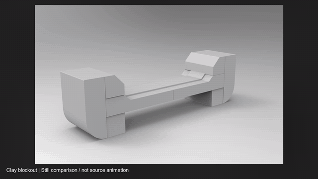

[Modeling review — still-image comparison](media/video/modeling-review.mp4)

This review film was assembled from selected screenshots, holding each for two seconds. It is not a recovered animation or a continuous recording of modeling operations.

## 02 / Wireframe and orthographic checks

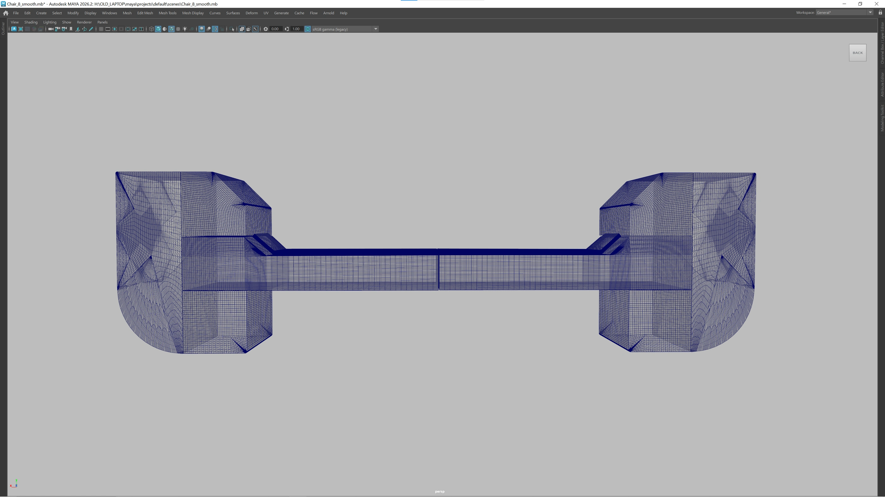
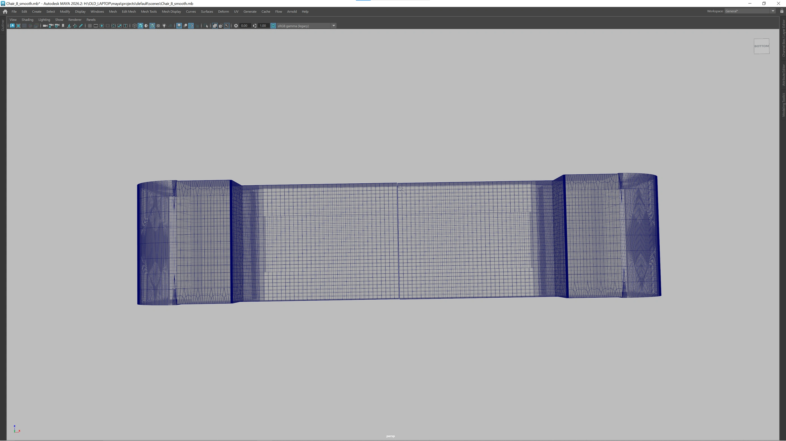

The angled view exposes the dense edge structure around the end block and the transition into the span. Front and top views make the seam and stepped profile easier to judge without perspective distortion. The screenshots preserve the working viewport, including areas where overlapping lines are visually difficult to read.

## 03 / Shaded form and junctions

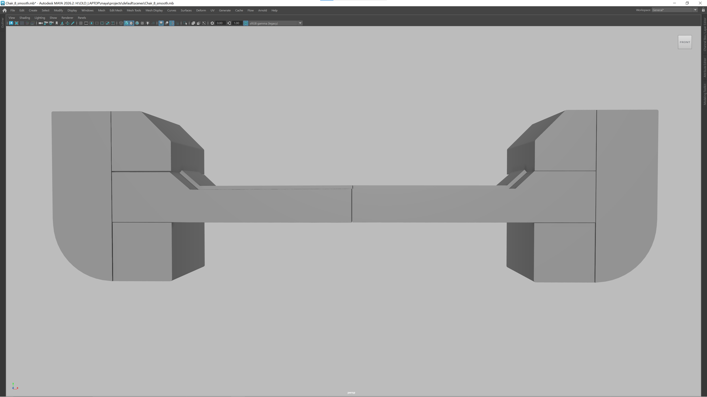
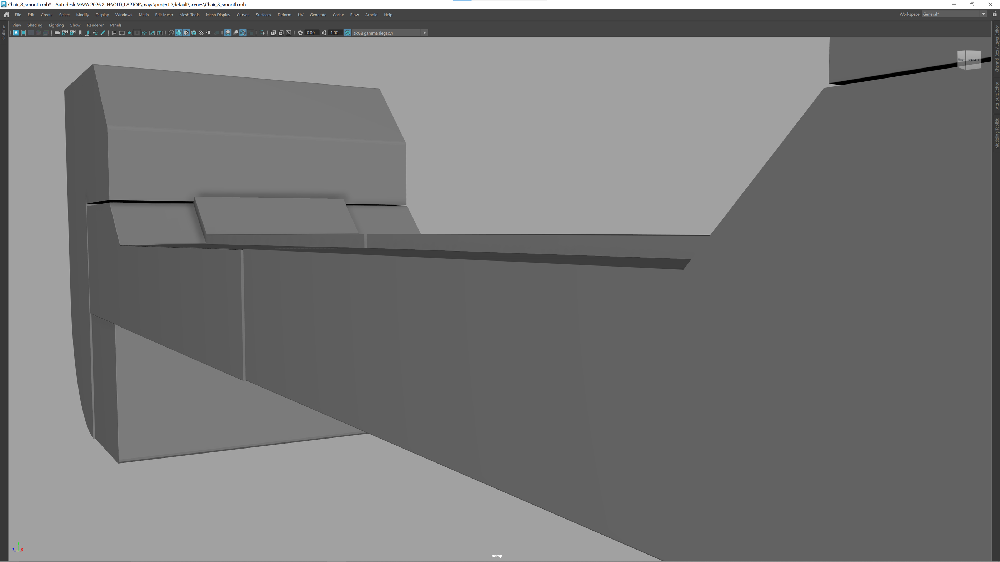

The shaded views remove the wireframe so the shape can be checked on its own. The close-ups focus on two decisions that remain visible in the final object: where the seat meets the raised back, and how the central seam crosses the surface.

These captures show inspection states and selected components. They do not provide enough evidence to assign every view to a distinct design revision or claim a particular mesh operation caused the change.

## 04 / Components and underside

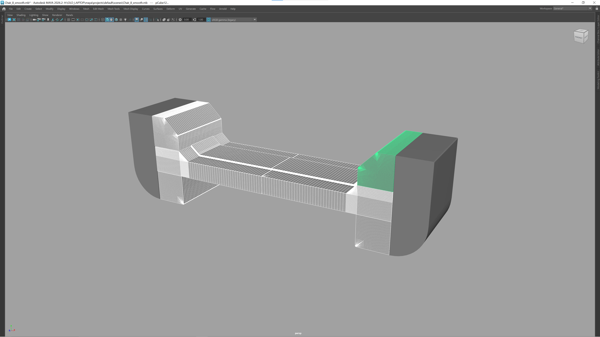
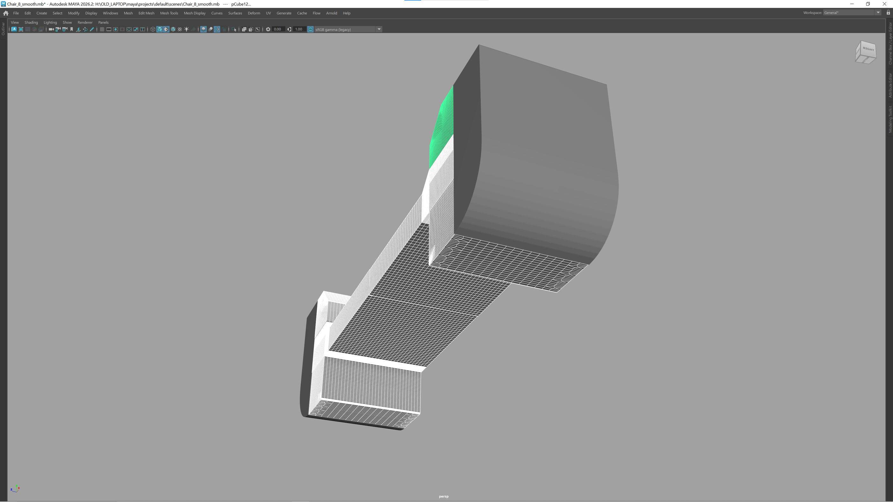
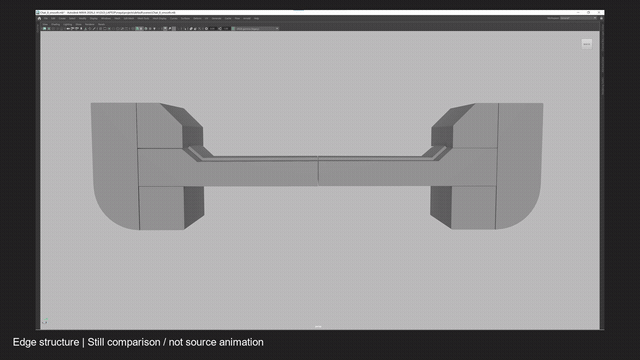

The selected end components and underside view reveal geometry hidden in the hero angle. They make the rounded bottom edge and the way the span enters the end block inspectable.

[Construction review — still-image comparison](media/video/construction-review.mp4)

## 05 / Timber, grain and the finished form

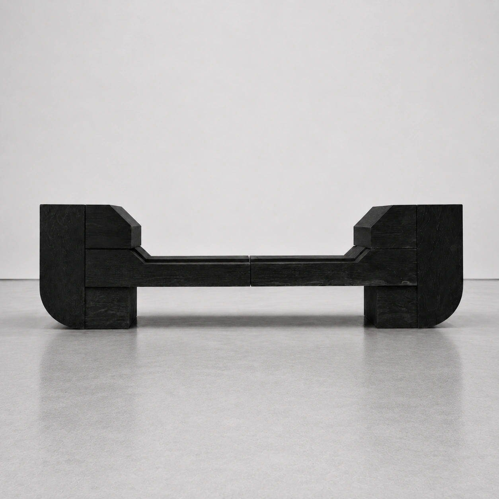
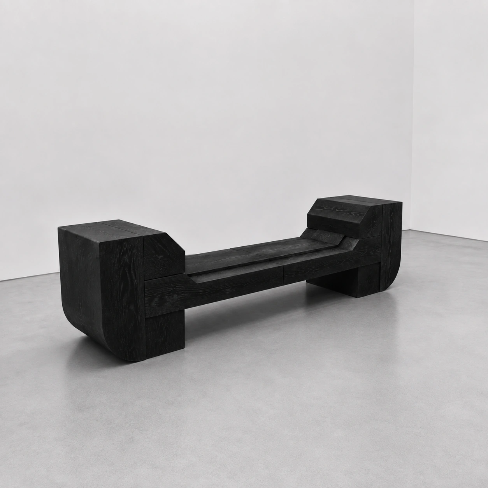
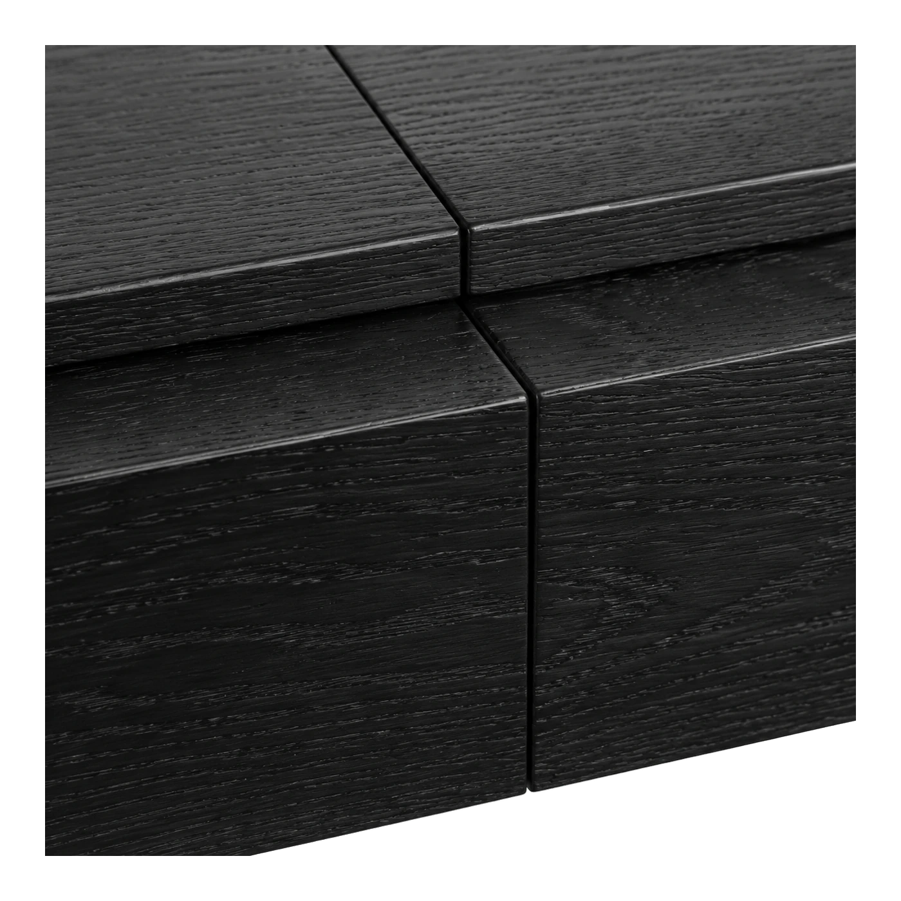

The dark, low-sheen timber treatment brings the grain close to the surface while preserving the seam. The rounded lower edge is quieter than in the clay view, but still softens the weight of each end block. The finished views can be read against the earlier front, top and junction captures rather than as isolated beauty shots.

[All working and final views](docs/media-index.md#images)

## Archive notes

- The source folder contains 22 screenshots. Fourteen distinct working views were selected; eight near-duplicate angles were left in the untouched source folder.
- Two MP4 comparisons and two GIF excerpts were created from stills. No numbered animation sequence or source movie was found in the chair folder.
- [Media index](docs/media-index.md) · [source manifest](docs/media-manifest.json) · [audit notes](docs/audit-notes.md)
- Final images come from `back-to-my-roots.html` and its linked chair assets. The archive documents the digital form and visualization; it does not claim tested joinery, structural performance or physical manufacture.

---

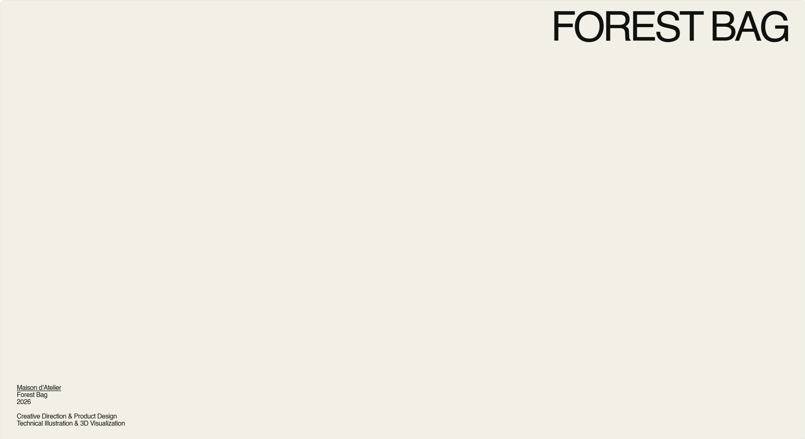

 

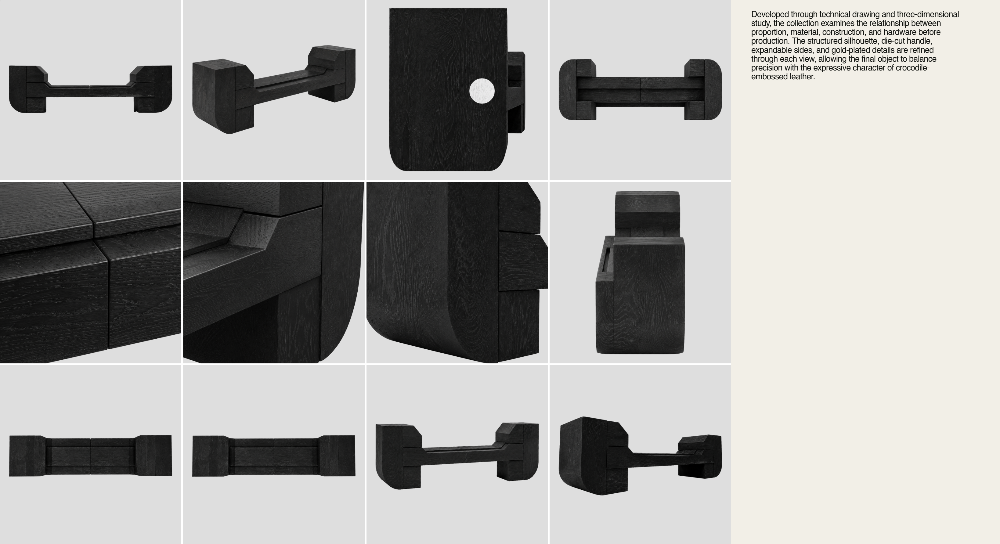

 

 

Maison d’Atelier  
Back to My Roots
