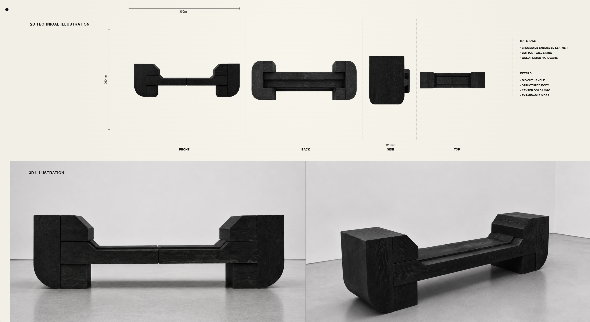
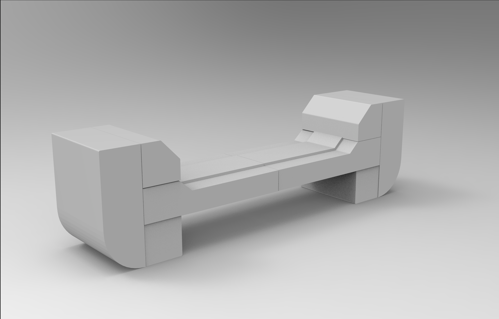
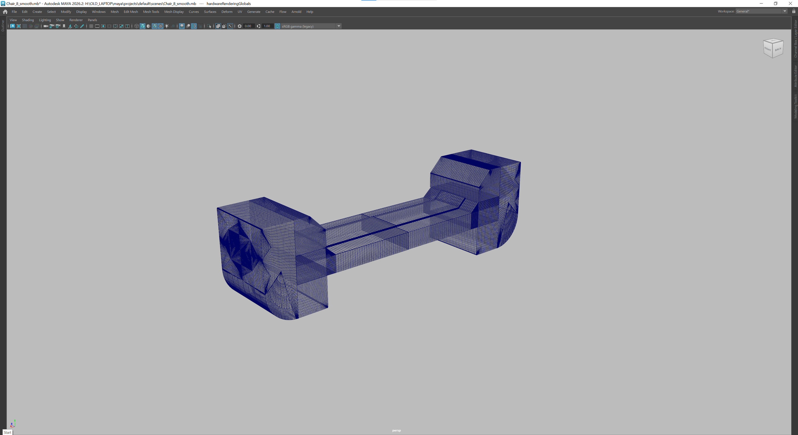
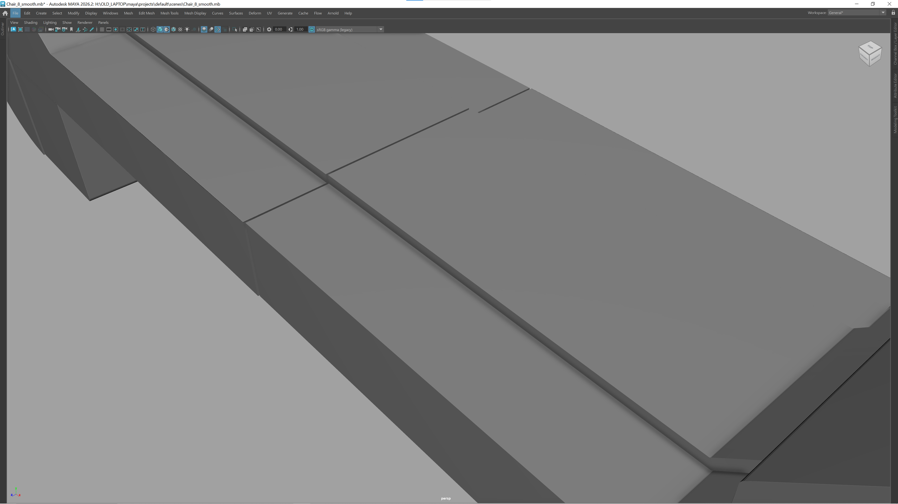

# Back to My Roots

**Maison d’Atelier**

A furniture study built around proportion, weight and a continuous seam. Modeled in Maya.

## 01 / Blockout

Blockout first. The proportions need to work before materials enter the picture.

<a href="media/video/modeling-review.mp4">Modeling review — still-image comparison</a>

## 02 / Topology

Wireframe and orthographic checks in Maya. This is where the edge flow and transitions get a closer look.

## 03 / Modeling

Checking the seat-to-back connection and the central seam in shaded mode.

## 04 / Modeling Details

Component-level modeling checks, including the underside and the rounded edges.

<a href="media/video/construction-review.mp4">Construction review — still-image comparison</a>

## 05 / Materials and Lighting

The low-sheen finish keeps the grain from taking over. The softer edge highlights are what make the final shots feel calm.

<a href="docs/media-index.md#images">All working and final views</a>

## Files

[Media](docs/media-index.md) · [Source notes](docs/media-manifest.json) · [Archive details](docs/audit-notes.md)

---

 

 

 

Maison d’Atelier  
Back to My Roots
